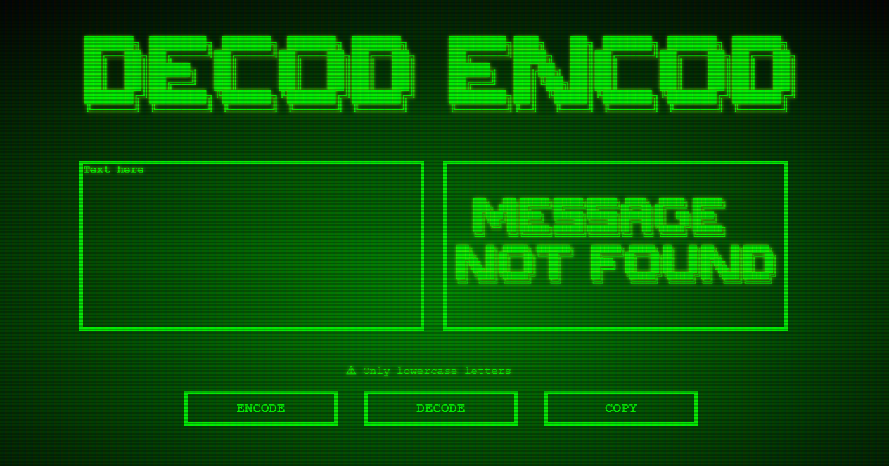

<h1 align="center" > Proposta do Desafio Decodificador da Alura </h1>

Este projeto envolve a criação de uma aplicação de criptografia de textos. O objetivo é permitir que as pessoas troquem mensagens secretas usando uma "chave" específica. As chaves são a substituição de letras como "e" por "enter" e "a" por "ai". O projeto requer a criação de campos na página para inserção do texto a ser criptografado ou descriptografado, e o resultado deve ser exibido na tela. Além disso, é desejável que seja possível copiar o resultado para a área de transferência. O desenvolvimento será feito utilizando o sistema ágil de desenvolvimento.

<h2> Resolução do Projeto </h2>

Este código HTML, CSS e JavaScript é para uma página da web que simula um terminal inspirado nas séries de filmes Matrix e Fallout. A página possui elementos como um terminal de texto onde o usuário pode digitar mensagens, botões para criptografia e descriptografia de mensagens, e um botão para copiar a mensagem criptografada ou descriptografada. Ao clicar no botão de criptografia, a mensagem no terminal é substituída por uma criptografia que substitui certas letras por outras. Ao clicar no botão de descriptografia, a mensagem é decodificada, voltando ao seu formato original. A página é estilizada para ter uma aparência de terminal de filme de ficção científica.

  

<h2> Criptografia </h2>

As "chaves" de criptografia do projeto são:

 <li>`A letra "e" é convertida para "enter"`</li>
 <li>`A letra "i" é convertida para "imes"`</li>
 <li>`A letra "a" é convertida para "ai"`</li>
 <li>`A letra "o" é convertida para "ober"`</li>
 <li>`A letra "u" é convertida para "ufat"`</li>

